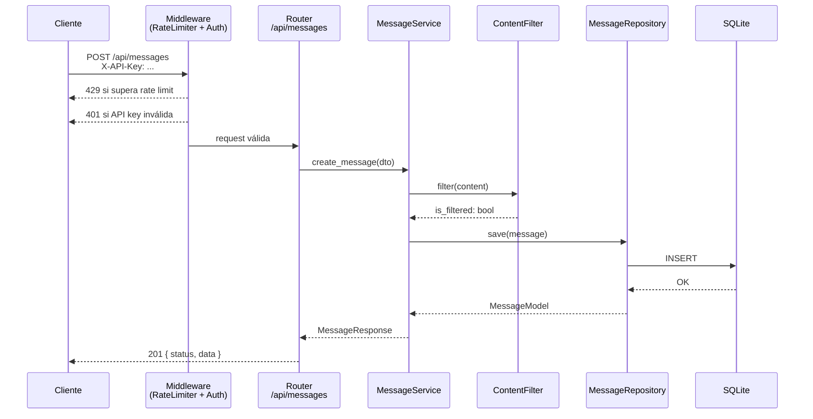
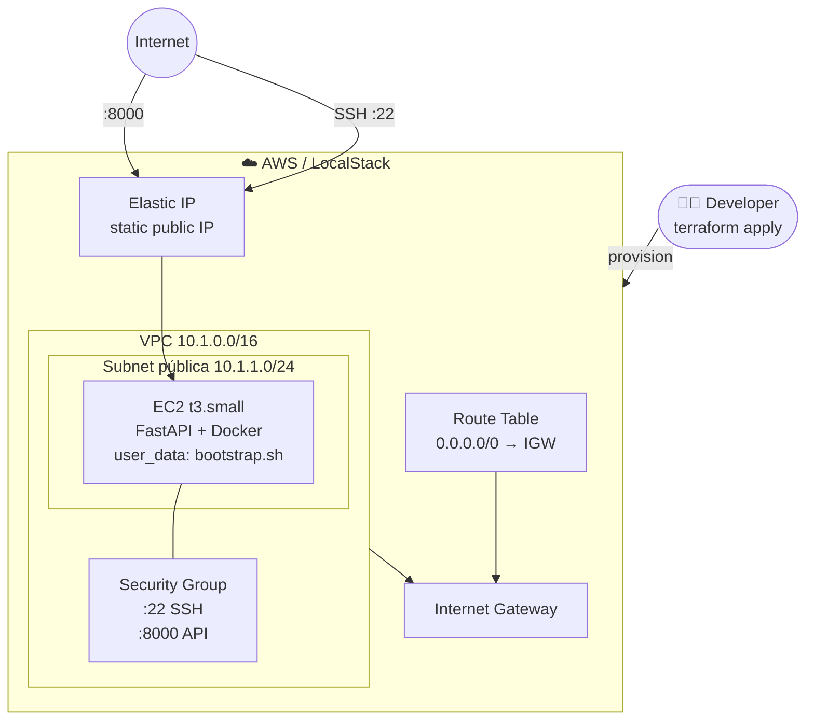

# Nequi Chat API

API RESTful para procesamiento de mensajes de chat, construida con **FastAPI + SQLAlchemy + SQLite**.

## Stack

| Componente | Tecnología |
|---|---|
| Framework | FastAPI 0.115 |
| ORM | SQLAlchemy 2.0 |
| Base de datos | SQLite |
| Validación | Pydantic v2 |
| Pruebas | Pytest + HTTPX |
| Contenedor | Docker + Docker Compose |

---

## Arquitectura

### Flujo de una request



### Infraestructura AWS (Terraform)



### Estructura de carpetas

```
app/
├── config.py                  # Configuración (pydantic-settings)
├── database.py                # Engine SQLAlchemy y sesión
├── main.py                    # Punto de entrada FastAPI
├── models/
│   └── message.py             # Modelo ORM Message
├── schemas/
│   └── message.py             # Schemas Pydantic (entrada/salida/error)
├── repositories/
│   └── message_repository.py  # Capa de acceso a datos
├── services/
│   ├── content_filter.py      # Filtro de contenido inapropiado
│   └── message_service.py     # Lógica de negocio
├── api/
│   ├── dependencies.py        # Inyección de dependencias FastAPI
│   ├── websocket_manager.py   # Gestor de conexiones WebSocket
│   └── routes/
│       └── messages.py        # Endpoints REST + WebSocket
└── core/
    ├── exceptions.py          # Excepciones de dominio
    ├── error_handlers.py      # Manejadores de error globales
    └── rate_limiter.py        # Middleware de limitación de tasa
```

Los principios SOLID se aplican de la siguiente manera:
- **S** — Cada clase tiene una única responsabilidad (repository, service, filter…)
- **O** — `ContentFilterService` acepta una lista de palabras inyectable
- **L** — Las dependencias se consumen por interfaz (tipo)
- **I** — Interfaces pequeñas y focalizadas
- **D** — Toda la lógica recibe sus dependencias por parámetro (DI vía FastAPI `Depends`)

---

## Inicio rápido con Docker Compose

```bash
# 1. Clonar el repositorio
git clone <url-del-repo> && cd reto-nequi

# 2. Crear archivo de entorno (opcional — los valores por defecto funcionan)
cp .env.example .env

# 3. Levantar el servicio
docker compose up --build

# La API queda disponible en http://localhost:8000
# Documentación interactiva: http://localhost:8000/docs
```

---

## Inicio sin Docker (desarrollo local)

```bash
python -m venv .venv
# Windows
.venv\Scripts\activate
# macOS/Linux
source .venv/bin/activate

pip install -r requirements.txt
cp .env.example .env

uvicorn app.main:app --reload
```

---

## Autenticación

Todos los endpoints REST requieren la cabecera `X-API-Key`.

```
X-API-Key: nequi-secret-key-change-in-production
```

Configura tu propia clave en `.env` → variable `API_KEY`.

> La documentación interactiva completa de la API está disponible en **http://localhost:8000/docs** (Swagger UI) una vez levantado el servicio.

---

## Ejecución de pruebas

```bash
# Todas las pruebas con reporte de cobertura
pytest

# Solo pruebas unitarias
pytest tests/unit/

# Solo pruebas de integración
pytest tests/integration/

# Reporte HTML de cobertura
pytest --cov-report=html
```

La configuración exige un mínimo del **80 % de cobertura** (definido en `pytest.ini`).

---

## Variables de entorno

| Variable | Valor por defecto | Descripción |
|---|---|---|
| `DATABASE_URL` | `sqlite:///./data/messages.db` | URL de conexión SQLAlchemy |
| `API_KEY` | `nequi-secret-key-change-in-production` | Clave de autenticación |
| `RATE_LIMIT_PER_MINUTE` | `60` | Solicitudes máximas por IP/minuto |
| `DEBUG` | `false` | Modo de depuración |

---

## Infraestructura con Terraform

La carpeta `terraform/` contiene la infraestructura como código para desplegar el backend en una instancia **EC2** de AWS (o en **LocalStack** para desarrollo local).

```
terraform/
├── main.tf                   # Provider AWS + soporte LocalStack
├── variables.tf              # Variables configurables
├── vpc.tf                    # VPC, subnet pública, Internet Gateway
├── security_groups.tf        # Puertos 22 (SSH) y 8000 (API)
├── ec2.tf                    # Instancia EC2 + Elastic IP + user_data
├── outputs.tf                # api_url, swagger_url, ssh_command…
├── terraform.tfvars.example  # Plantilla de variables
└── .gitignore                # Excluye estado y secretos
```

El `user_data` de la instancia instala Docker automáticamente, clona el repositorio y levanta el contenedor del backend.

### Con LocalStack (sin cuenta AWS)

> Requiere el contenedor LocalStack levantado desde la raíz del proyecto:
> ```bash
> docker compose -f ../docker-compose.localstack.yml up -d
> ```

```bash
cd terraform
cp terraform.tfvars.example terraform.tfvars   # ajusta key_pair_name y app_api_key
terraform init
terraform apply -var="use_localstack=true"
```

Tras `apply`, consulta las URLs generadas:

```bash
terraform output
# api_url     = "http://<IP>:8000"
# swagger_url = "http://<IP>:8000/docs"
```

### Con AWS real

```bash
export AWS_ACCESS_KEY_ID=...
export AWS_SECRET_ACCESS_KEY=...

cd terraform
cp terraform.tfvars.example terraform.tfvars   # edita key_pair_name (obligatorio)
terraform init
terraform apply
```

### Variables de Terraform destacadas

| Variable | Requerida | Descripción |
|---|---|---|
| `key_pair_name` | Sí (AWS real) | Key Pair existente en tu cuenta AWS |
| `app_api_key` | No | API Key del backend (coincide con `API_KEY`) |
| `use_localstack` | No | `true` para usar LocalStack, `false` para AWS real |
| `instance_type` | No | Tipo de instancia EC2 (por defecto `t3.small`) |


